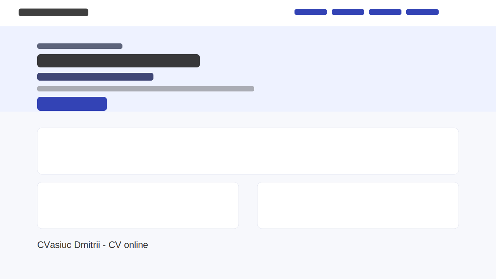

# Lab 2 - CV personal (RO)

## Descriere

Acest proiect este o pagină de tip landing page în limba română, construită ca un CV online pentru **CVasiuc Dmitrii**.

Conține:

- navigare între secțiuni;
- call to action în zona hero;
- minim 4 secțiuni (Despre mine, Experiență, Educație, Competențe, Proiecte, Contact);
- design simplu și responsive, realizat cu HTML + CSS vanilla.

## Screenshot

## Live demo

https://dmitrycvs.github.io/tum-web-lab2/
