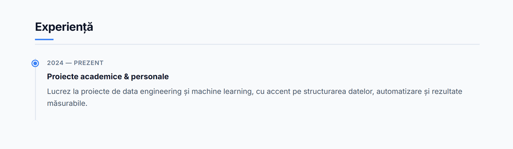
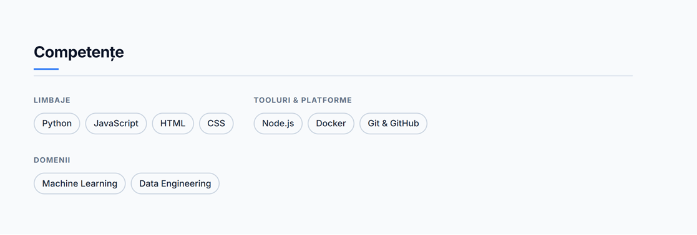

# CV Online — Cvasiuc Dmitrii

Pagină de tip landing page / CV personal, scrisă complet în **HTML + CSS vanilla** (fără framework-uri), disponibilă în limba română.

## Despre pagină

Site-ul prezintă profilul profesional al lui **Cvasiuc Dmitrii**, student în Ingineria Software la UTM și AI Engineer. Conține 6 secțiuni:

| Secțiune | Conținut |
|---|---|
| Hero | Nume, titlu, rezumat scurt, două CTA-uri |
| Despre mine | Descriere personală |
| Experiență | Timeline cu experiență academică și personală |
| Educație | UTM — Ingineria Software, Anul 3 |
| Competențe | Skills grupate pe categorii (Limbaje, Tooluri, Domenii) |
| Proiecte | Cards cu link direct pe GitHub |
| Contact | Secțiune dark cu CTA către GitHub |

**Stack:** HTML5 · CSS3 (custom properties, grid, flexbox, blur) · Inter (Google Fonts)

## Screenshots

### Navigare

### Experiență & Educație

### Competențe

## Live demo

https://dmitrycvs.github.io/tum-web-lab2/
